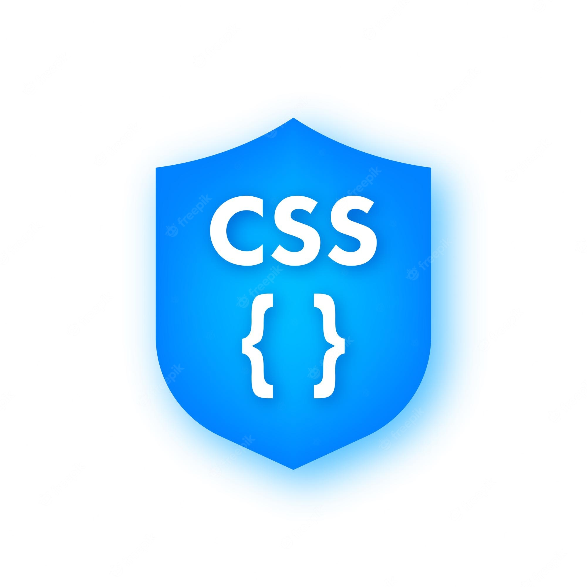
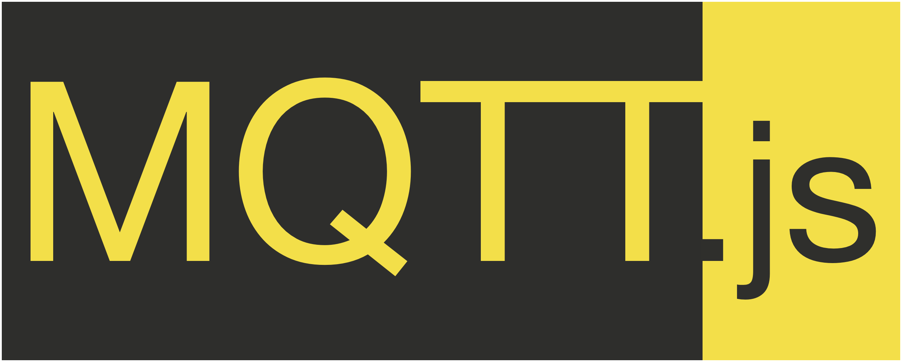

# SamyakJain 
<h1 align="center">Hi 👋 -- I'm Samyak Jain</h1>
<h2 align="center">A python developer</h2>

  

  

## work
I’m currently working at **LifeSignals India Pvt. Ltd.**

## Connect with me:

<h3> <a href="xxxxx">Linkedin</a> </h3>  

**samyakj79@gmail.com**

## Languages:

 &nbsp;&nbsp;&nbsp;&nbsp;
 &nbsp;&nbsp;&nbsp;&nbsp;
 &nbsp;&nbsp;&nbsp;&nbsp;
 &nbsp;&nbsp;
 &nbsp;&nbsp;&nbsp;&nbsp;
 &nbsp;&nbsp;&nbsp;&nbsp;

## Framework and Libraries:

 &nbsp;&nbsp;&nbsp;&nbsp;
 &nbsp;&nbsp;&nbsp;&nbsp;
 &nbsp;&nbsp;&nbsp;&nbsp;

